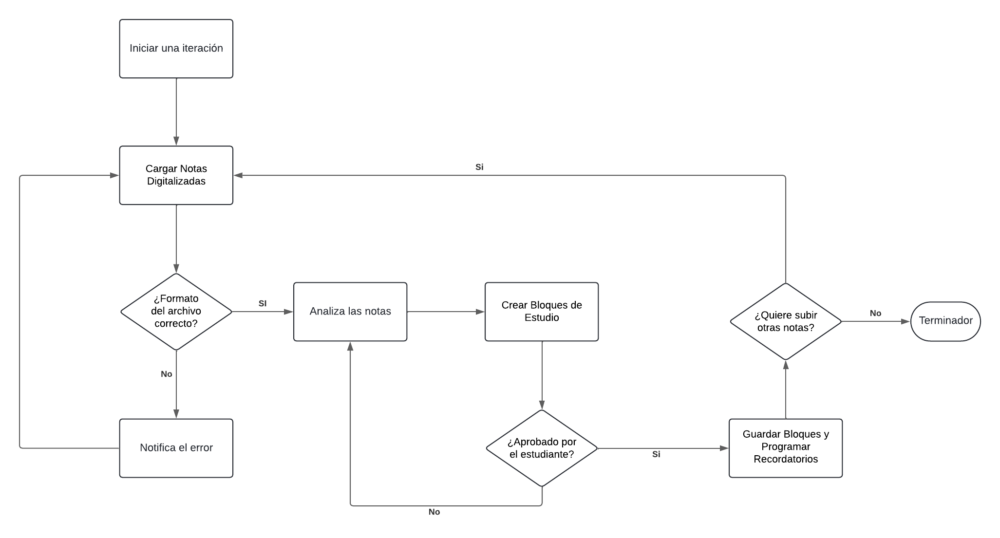

# StudyPlus

StudyPlus es un asistente virtual para estudiantes diseñado para ayudar a gestionar el tiempo de estudio de manera más efectiva. Utiliza técnicas de inteligencia artificial para analizar las notas digitalizadas del estudiante, generar horarios de estudio personalizados y enviar recordatorios. Además, el agente se adapta a las necesidades cambiantes del estudiante, ofreciendo recomendaciones y ajustes basados en su rendimiento y progreso.

## Tabla de Contenidos

- [Descripción del Proyecto](#descripción-del-proyecto)
- [Servicios del Agente](#servicios-del-agente)
- [Modelo REAS del Agente](#modelo-reas-del-agente)
- [Casos de Uso y Diagramas de Flujos](#casos-de-uso-y-diagramas-de-flujos)
- [Instrucciones de Instalación](#instrucciones-de-instalación)
- [Uso](#uso)
- [Contribuciones](#contribuciones)
- [Licencia](#licencia)

## Descripción del Proyecto

StudyPlus es una herramienta de software diseñada para interactuar con los estudiantes y ayudarlos a gestionar su tiempo de estudio de manera más efectiva. Utiliza técnicas de inteligencia artificial para analizar las notas digitalizadas del estudiante, generar horarios de estudio personalizados y enviar recordatorios para asegurar que el estudiante se mantenga al día con su plan de estudios.

## Servicios del Agente

| **Servicio**                     | **Descripción**                                                                                                                                               |
|----------------------------------|-----------------------------------------------------------------------------------------------------------------------------------------------------------------|
| Organización de Horarios         | El agente ayuda a los estudiantes a planificar su tiempo de estudio, creando horarios que optimizan su productividad y aseguran una cobertura equilibrada de todas las materias. |
| Recordatorios de Estudio         | Envía notificaciones para recordar al estudiante sobre sus horarios de estudio, exámenes próximos y tareas pendientes.                                          |
| Generación de Bloques de Estudio | Analiza las notas digitalizadas del estudiante y crea bloques de estudio eficientes que cubren todos los temas necesarios.                                     |
| Funcionalidades Futuras          | Integración con aplicaciones de notas, alertas personalizadas basadas en el rendimiento del estudiante, y análisis avanzados de datos de estudio para proporcionar recomendaciones personalizadas. |

## Modelo REAS del Agente

### Roles

| **Rol**   | **Descripción**                         |
|-----------|-----------------------------------------|
| Agente    | Asistente virtual de estudio.           |
| Usuario   | Estudiante que interactúa con el agente.|

### Entornos

| **Entorno**                | **Descripción**                                                                                                             |
|----------------------------|-----------------------------------------------------------------------------------------------------------------------------|
| Entorno de Estudio         | Contexto en el que el estudiante realiza sus actividades académicas (puede ser estático, como una biblioteca, o dinámico, como diferentes lugares y horarios de estudio). |
| Entorno de Planificación   | Contexto en el que el estudiante organiza su tiempo y tareas.                                                               |

### Acciones

| **Acción**                            | **Descripción**                                                                                                         |
|---------------------------------------|-------------------------------------------------------------------------------------------------------------------------|
| Recibir y Procesar Notas Digitalizadas| El agente analiza las notas digitalizadas proporcionadas por el estudiante.                                             |
| Generar y Ajustar Horarios de Estudio | El agente crea y ajusta horarios de estudio personalizados.                                                             |
| Enviar Recordatorios                  | El agente envía notificaciones y recordatorios basados en los horarios de estudio y fechas importantes.                 |

### Servicios

| **Servicio**                     | **Descripción**                                                                                                         |
|----------------------------------|-------------------------------------------------------------------------------------------------------------------------|
| Organización de Horarios         | Ayuda a planificar el tiempo de estudio del estudiante.                                                                 |
| Recordatorios de Estudio         | Notifica al estudiante sobre sus horarios de estudio y fechas importantes.                                              |
| Generación de Bloques de Estudio | Crea bloques de estudio eficientes basados en las notas digitalizadas del estudiante.                                    |

### Detalles Adicionales del Entorno

| **Tipo de Entorno**               | **Descripción**                                                                                                         |
|----------------------------------|-------------------------------------------------------------------------------------------------------------------------|
| Estático                          | El entorno de estudio no cambia (ejemplo: una biblioteca).                                                             |
| Dinámico                          | El entorno de estudio cambia según diferentes lugares y horarios.                                                      |
| Discreto                          | Las acciones y eventos ocurren en intervalos de tiempo separados y específicos.                                         |
| Continuo                          | Las acciones y eventos ocurren en un flujo constante sin intervalos definidos.                                          |

## Casos de Uso y Diagramas de Flujos

### Diagrama de Flujo

#### Generación de Bloques de Estudio


#### Organización de Horarios


### Diagrama de Casos de Uso

#### Generación de Bloques de Estudio


#### Organización de Horarios


## Instrucciones de Instalación

1. Clona el repositorio:
    ```sh
    git clone https://github.com/TU_USUARIO/StudyPlus.git
    ```
2. Navega al directorio del proyecto:
    ```sh
    cd StudyPlus
    ```
3. Crea y activa un entorno virtual:
    ```sh
    python -m venv env
    source env/bin/activate  # En Linux/Mac
    .\env\Scripts\activate  # En Windows
    ```
4. Instala las dependencias:
    ```sh
    pip install -r requirements.txt
    ```

## Uso

1. Abre el archivo `initial_agent.ipynb` en Jupyter Notebook:
    ```sh
    jupyter notebook notebooks/Iteracion1/initial_agent.ipynb
    ```

## Contribuciones

Las contribuciones son bienvenidas. Por favor, abre un issue o envía un pull request para discutir cualquier cambio que te gustaría hacer.

## Licencia

Este proyecto está licenciado bajo la Licencia MIT. Consulta el archivo [LICENSE](LICENSE) para más detalles.
